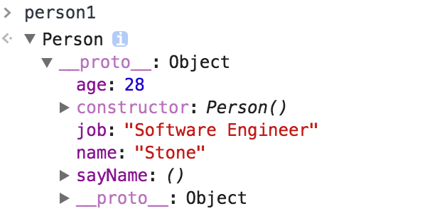
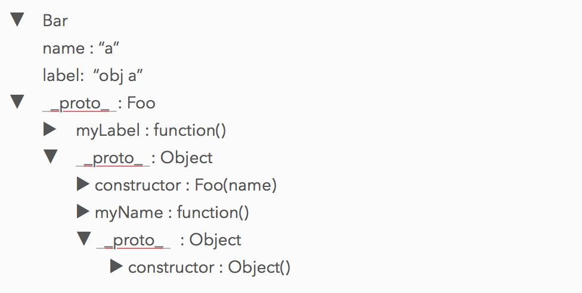
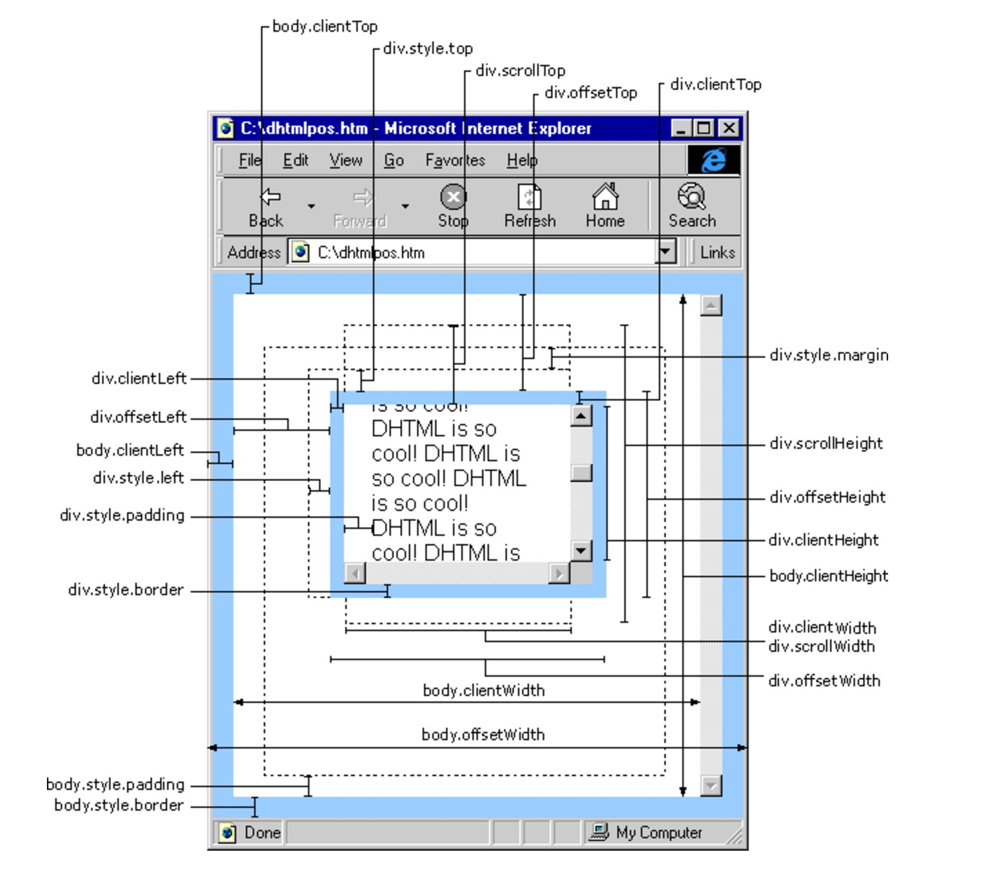

# 3main
布局、闭包、跨域、大小
## 布局
### 圣杯布局
* 1、左固定主内容自适应／右固定主内容自适应
```css
/* 左侧栏固定宽度，右侧自适应 */
	.container{
		padding-left : left's width; 
	}

	.left{
		width: absolute width;
		float:left; 
		margin-left: -100%; /*$$$$$*/ 
		position: relative;
		left: - left's width; /*$$$$$*/ 
	}

	.main{
		float: left;
		width: 100%;
	}
```

```css
/* 右侧栏固定宽度，左侧自适应 */
    .container {
        padding-right: right‘s width;
    }
    .right {
        float : left;
        width : absolute width;
        margin-left:  -this.width   /*$$$$$*/ 
        position: relative;
        right: -main's paddingRight; /*$$$$$*/ 
    }
    .main {
        float: left;
        width: 100%;
    }
```

* 2、左右固定，中间自适应
```css
	.container {
		padding-left : left's width; 
		padding-right: right‘s width;
	}

	.left{
		float : left;
      width : absolute width;
		margin-left: -100%;  /*$$$$$*/ 
		position: relative;
		left: - left's width; /*$$$$$*/ 
	}

	.right{
		float : left;
      width : absolute width;
		margin-left:  -this.width  /*$$$$$*/ 
      position: relative;
      right: -main's paddingRight; /*$$$$$*/ 
	}

	.main {
		float: left;
      width: 100%;
	}
```

* 3、都在一侧，另一侧自适应
``` css
 	.container{
		padding-left : 2 * left's width; 
	}

	.left1, .left2{
		width: absolute width;
		float:left; 
		position: relative;
	}

	.left1{
		margin-left: -100%; /*$$$$$*/ 
		left: - left's width; /*$$$$$*/ 
	}

	.left2{
		margin-left: -100%; /*$$$$$*/ 
		left: - 2 * left's width; /*$$$$$*/ 
	}

	.main{
		float: left;
		width: 100%;
	}
```

```css
	.container{
		padding-right : 2 * right's width; 
	}

	.right1, .right2{
		width: absolute width;
		float:left; 
		position: relative;
	}

	.right1{
		margin-left: - right's width; /*$$$$$*/ 
		right: - right's width; /*$$$$$*/ 
	}

	.right2{
		margin-left: - right's width; /*$$$$$*/ 
		right: - 2 * right's width; /*$$$$$*/ 
	}

	.main{
		float: left;
		width: 100%;
	}
```

* 原生获取css：IE中使用的是obj.currentStyle方法，而FF是用的是getComputedStyle 方法 
* box-sizing决定width包不包括padding和border

## cookie和session
* cookie存在客户端，session存在服务器
* cookie大小有4kb的限制、不能跨域、易被拦截
* cookie的删除可以把expires设置成过去的时间

## 作用域和闭包
* 闭包的定义：由于在 Javascript 语言中，只有函数内部的子函数才能读取局部变量，因此可以把闭包简单理解成定义在一个函数内部的函数。
* 闭包的用途：闭包可以用在许多地方。它的最大用处有两个，一个是可以读取函数内部的变量（作用域链），另一个就是让这些变量的值始终保持在内存中。怎么来理解这句话呢？请看下面的代码。
* 使用注意点：由于闭包会使得函数中的变量都被保存在内存中，内存消耗很大，所以不能滥用闭包，否则会造成网页的性能问题，在 IE 中可能导致内存泄露。解决方法是，在退出函数之前，将不使用的局部变量全部删除或设置为 null，断开变量和内存的联系。
闭包会在父函数外部，改变父函数内部变量的值。所以，如果你把父函数当作对象（object）使用，把闭包当作它的公用方法（public method），把内部变量当作它的私有属性（private value），这时一定要小心，不要随便改变父函数内部变量的值。
* this
```javascript
var name = '0';
var fun = function() {
    return this.name;
};
var oo = {
	name : '1',
	bb : {
		name : '2',
		ff : fun
	}
}
oo.bb.ff(); //2  只和最靠近的引用的有关
```

eval中的this：看谁在调用 eval() 方法，调用者的执行环境中的 this 就被 eval() 方法继承下来了

call() 和 apply() 是函数对象的方法，它的作用是改变函数的调用对象，它的第一个参数就表示改变后的调用这个函数的对象。因此，this 指代的就是这两个方法的第一个参数。call() 和 apply() 的参数为空时，默认调用全局对象。

## 原型
* 每个对象都有个__proto__属性指创建他的构造函数的prototype
* 普通对象：
```javascript
var o1 = {};
var o2 = new Object();
```
函数对象：
```javascript
function f1(){};
var f2 = function(){};
var f3 = new Function('str','console.log(str)');
```
凡是使用 function 关键字或 Function 构造函数创建的对象都是函数对象。而且，只有函数对象才拥有 prototype （原型）属性。
* 原型：
我们创建的每个函数都有一个 prototype（原型）属性。使用原型的好处是可以让所有对象实例共享它所包含的属性和方法。
```javascript
function Person(){}

Person.prototype.name = "Stone";
Person.prototype.age = 28;
Person.prototype.job = "Software Engineer";
Person.prototype.sayName = function(){
    console.log(this.name);
};

var person1 = new Person();
var person2 = new Person();
```


* 原型继承，  原型链
```javascript
function Foo(name) {
	this.name = name;
}

Foo.prototype.myName = function() {
	return this.name;
}

function Bar(name, label) {
	Foo.call(this, name);
	this.label = label;
}

Bar.prototype = Object.create( Foo.prototype );

Bar.prototype.myLabel = function() {
	return this.label;
}

var a = new Bar("a", "obj a");

a.myName(); //"a"
a.myLabel(); //"obj a"
```



> 1、a是一个Bar的实例；  
> 2、a有两个私有属性name、label；  
> 3、a的_proto_指向它的创造函数的原型（Bar.prototype、是一个Foo）；  
> 4、Bar.prototype 是 Foo的一个实例，拥有私有方法myLabel，它的_proto_指向它的创造函数的原型（Foo.prototype、是一个Object)  
> 5、Foo.prototype是一个Object，拥有私有方法myName，它的_proto_执行它的创造函数的原型（Object.prototype、是一个Object）  

用Object.assign扩展原型，将不会有__proto__的指向，用Object.create和new有效，ES6开始可以用Object.setPrototypeOf( Son.prototype,  Father.prototype)


## 大小

* outerWidth／outerHeight
IE、Safari、Firefox返回浏览器窗口本身尺寸
* innerWidth／innerHeight
IE、Safari、Firefox返回该容器中页面视图区的大小
* Chrome中inner和outer都返回视口大小（viewpoint）
* 目前基本浏览器都用document.documentElement.clientWidth_Height保存了页面视口的信息。IE6需要通过document.body.clientWidth_Height


