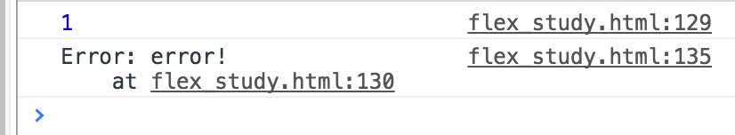

# ES6-promise
## 1.1. Promise
* 状态分三种
对象的状态不受外界影响。Promise对象代表一个异步操作，有三种状态：Pending（进行中）、Resolved（已完成，又称 Fulfilled）和Rejected（已失败）。

* 实例构造
```
var promise = new Promise(function(resolve, reject) {
  // ... some code

  if (/* 异步操作成功 */){
    resolve(value);
  } else {
    reject(error);
  }
});
```

1.、resolve和reject函数由引擎提供，不需要部署
2、前者是状态变成resolved时將异步操作的结果作为参数传递出去，后者是变成rejected时
3、promise新建之后立即执行

* 回调函数
promise实例生成之后，用then方法分别指定resolved和reject状态的回调
```
promise.then(function(value) {
  // success，resolved的回调函数，作为第一个参数
}, function(error) {
  // failure，reject的回调函数，作为第二个参数，可选
});
```

* 简单例子
```
function timeout(ms){
	return new Promise(function(resolve, reject) {
		setTimeout(resolve, ms, 'done');,//这里的第三个参数作为第一个函数的参数传入，所以被resolve输出.
	});
}

timeout(100).then(function(value) {
	console.log(value);
})
```

* 异步加载图片的例子
```
function loadImageAsync(url) {
  return new Promise(function(resolve, reject) {
    var image = new Image();

    image.onload = function() {
      resolve(image);
    };

    image.onerror = function() {
      reject(new Error('Could not load image at ' + url));
    };

    image.src = url;
  });
}
```

* 异步ajax
```
var getJSON = function(url) {
  var promise = new Promise(function(resolve, reject){
    var client = new XMLHttpRequest();
    client.open("GET", url);
    client.onreadystatechange = handler;
    client.responseType = "json";
    client.setRequestHeader("Accept", "application/json");
    client.send();

    function handler() {
      if (this.readyState !== 4) {
        return;
      }
      if (this.status === 200) {
        resolve(this.response);
      } else {
        reject(new Error(this.statusText));
      }
    };
  });

  return promise;
};

getJSON("/posts.json").then(function(json) {
  console.log('Contents: ' + json);
}, function(error) {
  console.error('出错了', error);
});
```


promise作为resolve和reject的参数
```
var p1 = new Promise(function (resolve, reject) {
    setTimeout(() => reject(new Error('fail')), 3000)
})
        
var p2 = new Promise(function (resolve, reject) {
    setTimeout(() => resolve(p1), 1000)
})

p2.then(result => console.log(result)) //p1 is rejected, p2 is the same as p1
.catch(error => console.log(error)) // Error: fail
```

p1是一个Promise，3秒之后变为rejected。p2的状态在1秒之后改变，resolve方法返回的是p1。此时，由于p2返回的是另一个Promise，所以后面的then语句都变成针对后者（p1）。又过了2秒，p1变为rejected，导致触发catch方法指定的回调函数


## 1.2. Promise.prototype.then()
then方法为promise添加状态发生改变的回调函数，返回一个promise实例的话采用链式写法

* 链式写法
```
getJSON(“/post/1.json”).then(function(post) {
  return getJSON(post.commentURL);
}).then(function funcA(comments) {
  console.log(“Resolved: “, comments);
}, function funcB(err){
  console.log(“Rejected: “, err);
});
```

## 1.3. Promise.prototype.catch()
catch(rejection)方法是then(null,rejection)的别称，仅仅当发生错误时执行，catch的存在是将错误回调函数从then()方法中剥离出来。
Promise 对象的错误具有“冒泡”性质，会一直向后传递，直到被捕获为止。也就是说，错误总是会被下一个catch语句捕获。

## 1.4. Promise.all()
用于将多个Promise实例包装成一个新的Promise实例。如果内部参数不是Promise实例，就调用Promise.resolve()将参数转换为Promise实例。
`var p = Promise.all([p1, p2, p3]);//接受一个Promise数组作为参数`
p的状态由p1、p2、p3决定，呈现&关系，fulfilled对应1，rejected对应0，分成两种情况：
（1）只有p1、p2、p3的状态都变成fulfilled，p的状态才会变成fulfilled，此时p1、p2、p3的返回值组成一个数组，传递给p的回调函数。
（2）只要p1、p2、p3之中有一个被rejected，p的状态就变成rejected，此时第一个被reject的实例的返回值（rejected的顺序有没有类似与操作的顺序？），会传递给p的回调函数。

## 1.5.Promise.race()
Promise.race()和Promise.all()同样是将多个Promise实例包装成一个新的Promise实例，但是只要实例数组中有一个实例率先改变状态，p的状态就跟着改变。那个率先改变的 Promise 实例的返回值，就传递给新实例的回调函数。
```
  const p = Promise.race([
          fetch('/resource-that-may-take-a-while'),
          new Promise(function (resolve, reject) {
            setTimeout(() => reject(new Error('request timeout')), 5000)
          })
        ]);
   p.then(response => console.log(response));
   p.catch(error => console.log(error));
```

上面代码中，如果5秒之内fetch方法无法返回结果，变量p的状态就会变为rejected，从而触发catch方法指定的回调函数。

## 1.6. Promise.resolve()
将现有对象转化为Promise对象，根据参数不同有不同结果：
(1) 参数是一个Promise实例，Promise.resolve()将原对象返回；
(2) 参数是具有then方法的对象，Promise.resolve方法会将这个对象转为Promise对象，然后就立即执行thenable对象的then方法。
```
        let thenable = {
          then: function(resolve, reject) {
            resolve(42);
          }
        };
        
        let p1 = Promise.resolve(thenable);
        p1.then(function(value) {
          console.log(value);  // 42
        });
```
(3) 如果参数是一个原始值(基本类型值)，或者是一个不具有then方法的对象，则Promise.resolve方法返回一个新的Promise对象，状态为Resolved。
```
var p = Promise.resolve('Hello');
        p.then(function (s){
          console.log(s)
        });
        // Hello
```
上面代码生成一个新的Promise对象的实例p。由于字符串Hello不属于异步操作（判断方法是它不是具有then方法的对象），返回Promise实例的状态从一生成就是Resolved，所以回调函数会立即执行。Promise.resolve方法的参数，会同时传给回调函数。
(4) Promise.resolve方法允许调用时不带参数，直接返回一个Resolved状态的Promise对象。所以，如果希望得到一个Promise对象，比较方便的方法就是直接调用Promise.resolve方法。
```
        //下一轮事件轮询开始
        setTimeout(function () {
          console.log('three');
        }, 0);
        //本轮事件轮询末尾
        Promise.resolve().then(function () {
          console.log('two');
        });
        //立即执行
        console.log('one');
        
        // one two three
```
上面代码中，setTimeout(fn, 0)在下一轮“事件循环”开始时执行，Promise.resolve()在本轮“事件循环”结束时执行，console.log(’one‘)则是立即执行，因此最先输出。

## 1.7. Promise.reject()
Promise.reject()返回一个Promise实例，实例状态为rejected。Promise.reject()方法的参数，会原封不动地作为reject的理由，变成后续方法的参数。这一点与Promise.resolve方法不一致。
```
        var p = Promise.reject('出错了');
        // 等同于var p = new Promise((resolve, reject) => reject('出错了'))
        //参数就是’出错了’
        p.then(null, function (s) {
          console.log(s)
        });// 出错了
```

```
      const thenable = {
          then(resolve, reject) {
            reject('出错了');
          }
        };
        //参数就是thenable
        Promise.reject(thenable)
        .catch(e => {
          console.log(e === thenable)
        })
        // true
```

上面代码中，Promise.reject方法的参数是一个thenable对象，执行以后，后面catch方法的参数不是reject抛出的“出错了”这个字符串，而是thenable对象。

# 进阶
## 2.1 使用Promise.resolve()创建Promise对象
任何有可能 throw 同步异常的代码都是一个后续会导致几乎无法调试异常的潜在因素。但是如果你将所有代码都使用Promise.resolve() 封装，那么你总是可以在之后使用 catch() 来捕获它。
```
function somePromiseAPI() {
    return Promise.resolve().then(function(){
        console.log(1)；
        throw new Error('error!');
        return 'foo';
    }).then(function () {
        console.log(2)；
    }).catch(function (err) {
        console.log(err)；
    });
}
```



## 2.2 catch() 与 then(null, ...) 根据使用场景并非完全等价
```
    somePromise().then(function(){
        return someOtherPromise();
    }).catch(function(err){
        //error
    });
    ///////////////////////////////
    somePromise().then(function(){
        return someOtherPromise();
    },function(err){
        //error
    });
```

当你使用 then(resolveHandler, rejectHandler) 这种形式时，rejectHandler 并不会捕获由 resolveHandler 引发的异常。最好不使用then()的第二个参数，而是总是使用catch()。

## 2.3 promises factories
```
 function executeSequentially(promiseFactories){
   var result = Promise.resolve();
   promiseFactories,forEach(function (promiseFactory){
      result = result.then(promiseFactory)
   });
   return result;
}
function promiseFactory(){
    return somethingThatCreatesAPromise();
}
```

这是因为一个 promise factory 在被执行之前并不会创建 promise。它就像一个 then 函数一样，而实际上，它们就是完全一样的东西。如果你查看上面的 executeSequentially() 函数，然后想象 myPromiseFactory 被包裹在 result.then(...) 之中，也许你脑中的小灯泡就会亮起。在此时此刻，对于 promise 你就算是悟道了。

## 2.4 promises 穿透
```
Promise.resolve(‘foo’).then(Promise.resolve(‘bar’)).then(function(result){
        console.log(result);
        });
```
then()接受非函数的参数时，会解释为then(null)，这就导致前一个Promise的结果穿透到下面一个Promise。
正确写法：
```
        Promise.resolve(‘foo’).then(function(){
        return Promise.resolve(‘bar’);
        }).then(function(result){
        console.log(result);
        });
```

## 2.5 Promise.all()
Promise.all()以一个Promise数组作为输入，返回一个新的Promise，特点在于它会并行执行数组中的每个Promise，并且每个Promise都返回后才返回结果数组，这就数组的异步版map/forEach方法。但是如果需要返回两个不相关的结果，使用Promise.all()可以产生两个不相关的数组结果；但是如果后一结果要依靠前一个结果产生，此时在Promise里使用嵌套也就可以的。

[Promise初级与进阶—都在这了 - Web Learning Step by Step - SegmentFault](https://segmentfault.com/a/1190000008548794) 
